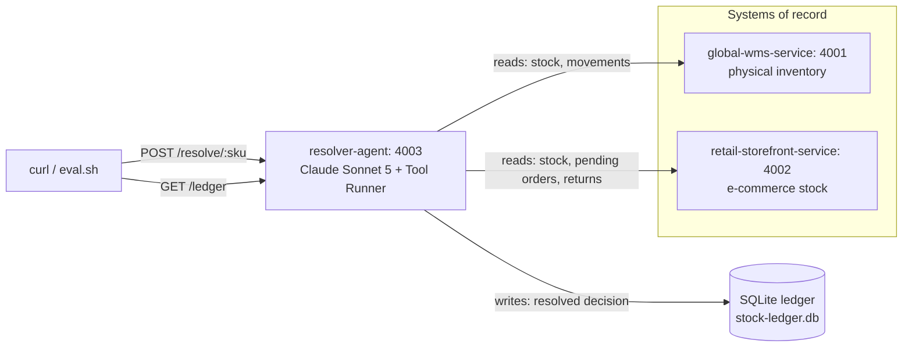

# Stock Ledger

## About

Two mock services disagree about how much stock is in a warehouse. A third
service, an AI agent, investigates each disagreement, decides which number
is right (or admits it can't tell), and writes that decision to a permanent,
inspectable database.

Two systems of record can disagree about the same number for a lot of
different reasons: a sync delay, a return in transit, a damaged unit that
hasn't been written off yet. A fixed rule ("always trust the warehouse",
"trust whichever timestamp is newer") is right for exactly one of those
causes and wrong for the rest, because each cause needs a different piece
of context to explain it.

This project gives an AI agent a small set of read-only tools to
investigate: a physical inventory count, a movement history, a list of
pending orders, a list of returns in transit, plus one tool to record its
decision. The interesting case isn't when the agent finds a clean
explanation, it's when it doesn't: a good investigation says "I can't
explain this one, a human should look" instead of guessing. See
[scenarios/SCENARIOS.md](./scenarios/SCENARIOS.md) for exactly why each
seeded SKU disagrees, and what a correct investigation concludes for each
one.

## System overview



`resolver-agent` never reaches into the other two services' code or
data directly — it calls their REST APIs over plain HTTP. That's on purpose: it keeps the two systems of
record independent, the way a warehouse system and an e-commerce
platform can be in the real life — owned separately, and only reachable
from the outside.

## What's in here

Three small services, each its own folder under `services/`:

-   **`global-wms-service`** (port 4001): a fake warehouse system. Physical
    stock counts, updated periodically, not live.
-   **`retail-storefront-service`** (port 4002): a fake e-commerce inventory feed.
    Updates more often, but its number is calculated, not physically counted.
-   **`resolver-agent`** (port 4003): calls both of the above, asks
    Claude to investigate a discrepancy, and records the result. This is the
    one that needs an Anthropic API key.

`global-wms-service` and `retail-storefront-service` also accept `POST`, `PUT`, and
`DELETE` on their resources, so you can hand-edit records to build your own
scenarios. Those write endpoints are for you, not for the agent:
`resolver-agent` only ever calls the `GET` endpoints — see
[Building your own scenarios](#building-your-own-scenarios) below.

There's no authentication anywhere in this project — that's intentional,
it's not what this demo is about.

## Prerequisites

-   Node.js 20 or newer.
-   An Anthropic API key. If you don't have one, create it at
    [console.anthropic.com](https://console.anthropic.com/) — you'll need it
    in the step below.

## Setup

1. Install everything (this installs all three services at once, since
   they're set up as npm "workspaces" inside one repo):

    ```sh
    npm install
    ```

2. Give `resolver-agent` your API key:

    ```sh
    cp services/resolver-agent/.env.example services/resolver-agent/.env
    ```

    Then open `services/resolver-agent/.env` and replace
    `sk-ant-your-key-here` with your real key.

## Running it

You need all three services running at the same time, so open three
terminal windows/tabs in this folder and run one command in each:

```sh
npm run dev:wms         # terminal 1
npm run dev:storefront  # terminal 2
npm run dev:agent       # terminal 3
```

Each one prints the URL it's listening on when it's ready.

## Trying it out

With all three running, in a fourth terminal:

```sh
curl -X POST http://localhost:4003/resolve/SKU-005
```

That asks the agent to investigate `SKU-005` — the one scenario with no
clean explanation, seeded on purpose so you can see the agent say "I
couldn't find a cause" instead of guessing. Swap in `SKU-001` through
`SKU-004` for the other four scenarios, each with a different, explainable
cause, or `SKU-006` for a SKU that's missing from the warehouse system
entirely rather than merely disagreeing (see
[scenarios/SCENARIOS.md](./scenarios/SCENARIOS.md)).

To see everything the agent has decided so far:

```sh
curl http://localhost:4003/ledger
```

To check all six scenarios at once against their expected outcome, see
`scripts/eval.sh` under [Tests](#tests) below.

## Building your own scenarios

`global-wms-service` and `retail-storefront-service` keep their data in memory, seeded
fresh every time each service starts — so both accept `POST`, `PUT`, and
`DELETE` on their resources (see each service's `openapi.yaml` for the exact
shapes) for building your own scenarios by hand:

```sh
curl -X POST http://localhost:4001/inventory \
  -H "Content-Type: application/json" \
  -d '{"sku":"SKU-100","quantityOnHand":7,"lastCountedAt":"2026-01-01T00:00:00.000Z","location":"F1"}'

curl -X PUT http://localhost:4001/inventory/SKU-100 \
  -H "Content-Type: application/json" \
  -d '{"quantityOnHand":3,"lastCountedAt":"2026-01-02T00:00:00.000Z","location":"F1"}'

curl -X DELETE http://localhost:4001/inventory/SKU-100
```

`resolver-agent` never calls any of these — its tools (see
[services/resolver-agent/src/agent/tools.ts](./services/resolver-agent/src/agent/tools.ts))
only ever issue `GET` requests against the other two services. The write
endpoints exist for you to experiment with, not for the agent. Since the
data is in-memory, restarting a service resets it back to the six seeded
SKUs — there's nothing to clean up after you're done.

## Where the ledger lives

`resolver-agent` stores every decision in a SQLite database — a
single file, not a separate database server — at
`services/resolver-agent/src/ledger/stock-ledger.db`. It's created
automatically the first time the service runs.

Because it's just a file, you can open it directly with any SQLite tool,
whether the service is running or not — `GET /ledger` is a convenience,
not the only way in. On macOS, the `sqlite3` command line tool is already
installed:

```sh
sqlite3 services/resolver-agent/src/ledger/stock-ledger.db \
  "SELECT * FROM ledger_entries;"
```

A GUI like [DB Browser for SQLite](https://sqlitebrowser.org/), or a
"SQLite Viewer" extension in VS Code, works too if you'd rather click
around than type SQL. This file is listed in `.gitignore`, so it stays on
your machine and is never committed.

## Tests

`global-wms-service` and `retail-storefront-service` each have a small test suite that
checks their real responses actually match what `openapi.yaml` promises.

`resolver-agent` has unit tests too, but only for the parts that don't
depend on a live call to Claude.

Run all of the above with:

```sh
npm test
```

For the part `npm test` can't cover — whether the agent's actual decisions
are still right — there's `scripts/eval.sh`. It runs all six seeded SKUs
against a running `resolver-agent` and checks `recommendedAction` against
what [scenarios/SCENARIOS.md](./scenarios/SCENARIOS.md) says it should be.
This calls the real Claude API, so it's not part of `npm test` or CI.
Run it by hand after changing the system prompt, the tools, or the seed
data:

```sh
./scripts/eval.sh
```

## License

[](https://opensource.org/licenses/Apache-2.0)
