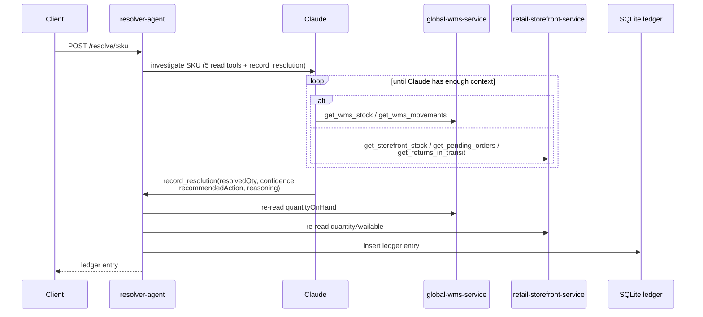

# Seed scenarios

Six SKUs, seeded deterministically in `services/global-wms-service/src/data/seed.ts`
and `services/retail-storefront-service/src/data/seed.ts`. Each one is a different, real
reason the two systems can disagree about the same product.

## How a resolution happens

`POST /resolve/:sku` hands the SKU to Claude along with five read-only tools
and one write tool. Claude decides which read tools to call and in what order,
then calls `record_resolution` exactly once to report its verdict and write it
to the ledger:

Three things worth noticing.

**Claude decides how much to investigate, and in practice it investigates
everything.** Nothing forces it to call all five read tools, but across
observed runs it has called all five for every SKU — including the easy ones,
where the first thing it checks already explains the gap — varying only the
order. That costs roughly five HTTP calls and ~12 seconds per SKU, and it
buys something worth having: when a ledger entry says "no pending orders were
found," a request really did go out and come back empty. The negative claims
in the reasoning are auditable, not narrative filler. Since this is model
behavior rather than an enforced rule, treat it as an observation to re-check
after changing the tool descriptions or the system prompt — not a guarantee.

**`record_resolution` is the only tool with a side effect.** It's both how the
agent reports its answer and how that answer gets persisted, so there's no
separate "save" step Claude could forget — and no way for it to announce a
conclusion that never reaches the ledger. If the run finishes without it
firing, `resolveSku` throws rather than returning an unrecorded decision.

**The fact columns in the ledger don't come from the model.** When
`record_resolution` runs, it re-reads `/inventory/{sku}` and `/stock/{sku}`
itself (the two extra calls in the diagram above) and stores those values as
`wmsQty` and `storefrontQty`. The model supplies the judgment —
`resolvedQty`, `confidence`, `recommendedAction`, `reasoning` — but not its
own account of what the two systems said. A SKU missing from one system is
recorded as `null` there rather than failing the whole resolution, which is
what makes `SKU-006` below distinguishable from a genuine count of zero.

| SKU       | Warehouse says | Webshop says | Why they disagree                                                                                                                                                                                                   | What a good investigation concludes                                                                                                                    |
| --------- | -------------- | ------------ | ------------------------------------------------------------------------------------------------------------------------------------------------------------------------------------------------------------------- | ------------------------------------------------------------------------------------------------------------------------------------------------------ |
| `SKU‑001` | 50             | 38           | The webshop last synced 18 hours ago; the warehouse ran a fresh cycle count 2 hours ago that found 12 more units after a restock.                                                                                   | Trust the warehouse (50) — the webshop number is just stale.                                                                                           |
| `SKU‑002` | 40             | 28           | 12 units are reserved by two pending orders that haven't shipped yet. They're still physically on the shelf, but already spoken for.                                                                                | Trust the webshop (28) — those units aren't really available even though the warehouse still counts them.                                              |
| `SKU‑003` | 20             | 23           | A 3-unit return was credited back to the webshop 2 days ago, but the physical item hasn't reached the warehouse yet.                                                                                                | Trust the warehouse (20) until the return actually lands.                                                                                              |
| `SKU‑004` | 40             | 32           | 8 units were quarantined as damaged an hour ago. The warehouse's own on-hand summary hasn't been updated yet — that only happens at the next cycle count — but the webshop's sync already picked up the correction. | Trust the webshop (32) — it's already correct.                                                                                                         |
| `SKU‑005` | 25             | 15           | Nothing. No pending order, no return, no quarantine event explains a 10-unit gap.                                                                                                                                   | No clean explanation exists — this one should be escalated to a human, not guessed at.                                                                 |
| `SKU‑006` | _(no record)_  | 10           | Not a disagreement — the warehouse system has never heard of this SKU. It's live and selling on the webshop, but nobody set it up in the warehouse's `inventory`.                                                   | Escalate to a human. There's no physical count to fall back on, so don't assume the webshop's number is safe just because it's the only one available. |

`SKU‑005` and `SKU‑006` are the important ones for the demo, in different ways.
`SKU‑005` is what stops the agent from just being "pick the bigger number" or
"average them" — it investigates, finds nothing that explains the gap, and
says honestly instead of inventing a plausible-sounding cause. `SKU‑006` is
a sharper version of the same discipline: a missing record isn't a number to
guess at all, and the agent should say that plainly rather than quietly
treating the one number it does have as good enough.

Want a seventh scenario of your own? Both services accept `POST`/`PUT`/`DELETE`
on their resources, so you can create a new SKU or edit an existing one
without touching any code — see
[Building your own scenarios](../README.md#building-your-own-scenarios) in
the main README.

One worth trying, because none of the six seeded cases exercises it: a
`quarantine` movement that is later undone by a `release`, with the webshop's
`lastSyncedAt` falling **between** the two. The webshop's number was correct
when it synced and is stale now, so both of the obvious heuristics — "trust
the freshest sync" and "a quarantine means trust the webshop", which is what
`SKU-004` teaches — give the wrong answer. Getting it right means ordering
three events against a sync timestamp.
